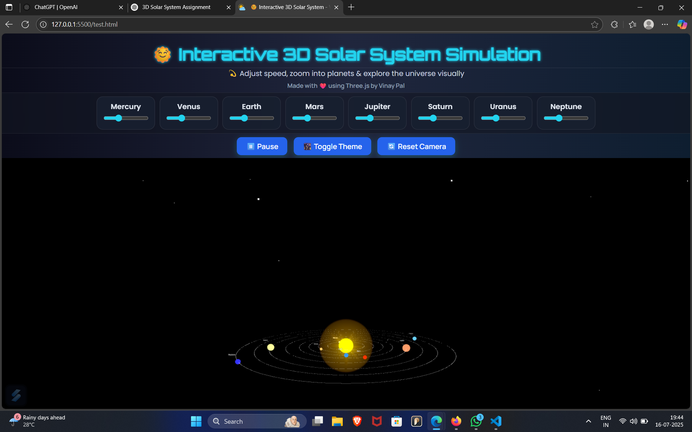
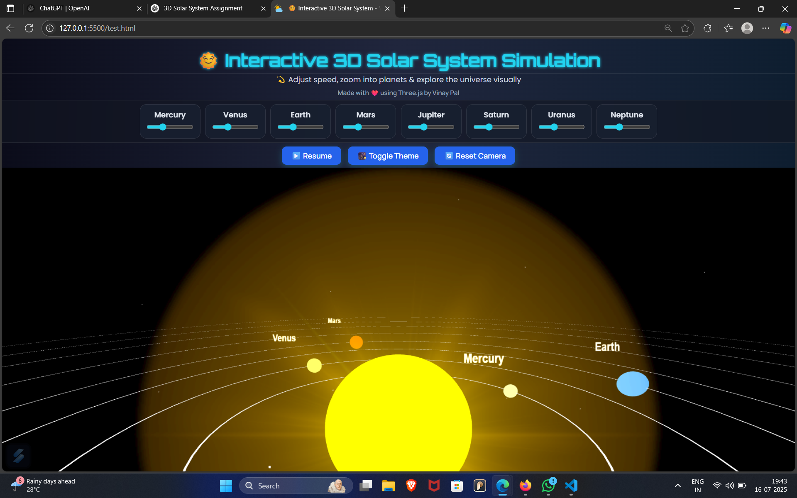

# 🌞 Interactive 3D Solar System – Vinay Pal

This is a 3D solar system simulation built using **Three.js** as part of the Frontend Developer Assignment.

## 🚀 Features

- Sun at center with glowing effect
- 8 planets with accurate distance, orbit speed, and sizes
- Real-time speed control for each planet
- Pause/Resume animation feature
- Dark/Light theme toggle
- Planet tooltips on hover
- Click to zoom into planet
- Starfield background for deep-space feel
- Responsive design for mobile and desktop

## 💻 Technologies Used

- HTML5
- CSS3 (Glassmorphism UI)
- JavaScript (ES6)
- Three.js (via CDN)

## ▶️ How to Run

1. Download or clone the repository
2. Open `index.html` directly in any modern browser (Chrome/Edge/Firefox)
3. Enjoy exploring the solar system!

## 🖼️ Output Screenshots

### 🌌 Solar System Simulation View

### 🌍 Orbiting Planets

## 🎥 Demo Video

🔗 [Watch Demo Video on YouTube](https://youtu.be/zgx2dWhNlPs)

---

📧 **Submission Subject:**  
Frontend Assignment – Vinay Pal
